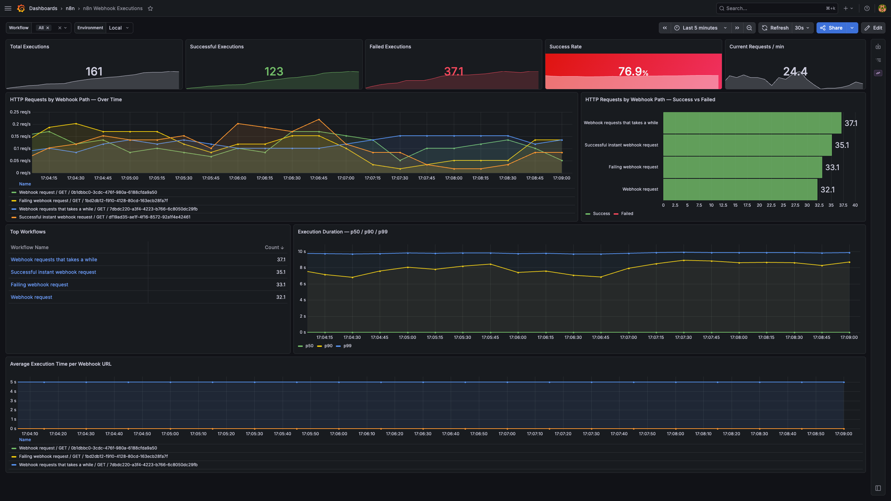
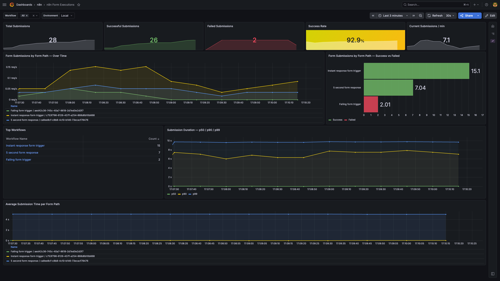

# n8n observability

Public collection of dashboards and tools to stay in the loop about how your n8n instances are doing.

Currently covers Prometheus + Grafana, with more observability tools planned (e.g. OpenTelemetry).

## Dashboards

| Dashboard | Description | Screenshot |
|-----------|-------------|------------|
| [n8n Webhook Executions](dashboards/grafana/n8n-webhook-executions/) | Execution counts, success/failure rates, and latency for webhook workflows |  |
| [n8n Form Executions](dashboards/grafana/n8n-form-executions/) | Execution counts and success/failure rates for form workflows |  |

Each dashboard folder contains the Grafana JSON file and a README with import instructions and the required n8n environment variables.

## Local development

The [`local-dev/`](local-dev/) directory contains a Docker Compose stack that spins up Prometheus and Grafana locally, with the dashboards above auto-loaded and live-reloaded.

### Prerequisites

Enable metrics in n8n:

```
N8N_METRICS=true
```

See our [Prometheus docs page](https://docs.n8n.io/hosting/configuration/configuration-examples/prometheus/) for more info. Verify by visiting `http://your-n8n-host.com/metrics`.

### Start the stack

```bash
cd local-dev
docker compose up -d
```

| Service    | URL                   | Credentials   |
|------------|-----------------------|---------------|
| Grafana    | http://localhost:3000 | admin / admin |
| Prometheus | http://localhost:9090 | —             |

Open `http://localhost:9090/targets` to verify the `n8n` target shows **UP**.

### Slack alerts (optional)

A bundled alert fires a Slack notification when a workflow produces more than 5 failed webhook executions in 30 seconds.

```bash
export GRAFANA_SLACK_TOKEN=xoxb-...   # Slack bot token with chat:write scope
export GRAFANA_SLACK_CHANNEL=C0123ABC  # channel ID to post to
docker compose up -d
```

If either variable is unset, Slack provisioning is skipped and Grafana boots without it.

### Stop

```bash
docker compose down
```

Data is persisted in named Docker volumes (`n8n_prometheus_data`, `n8n_grafana_data`). To wipe it:

```bash
docker compose down -v
```

## License

This project is licensed under the [MIT License](LICENSE.md).
