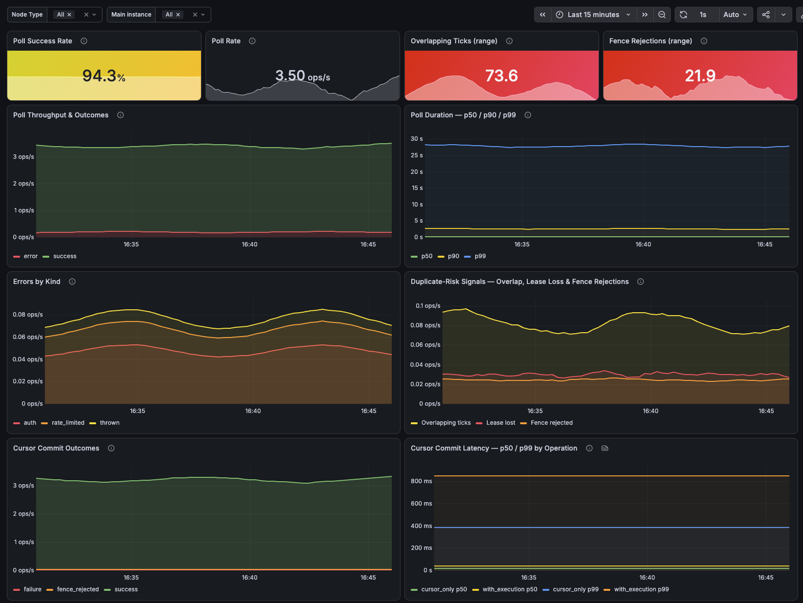
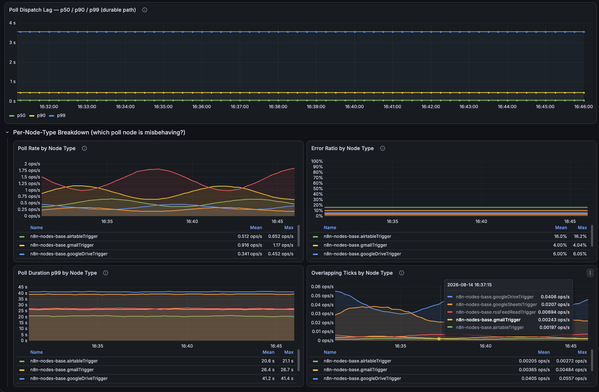

# n8n Poll Triggers Dashboard

Poll tick throughput, duration, error kinds, overlap and duplicate-risk signals,
and poll-cursor commit health for n8n's poll triggers — the baseline
instrumentation for the poll reliability work.

## Screenshots



Expand the collapsed **Per-Node-Type Breakdown** row to spot which poll node is
misbehaving (here the Google Drive trigger stands out — slow p99 and the most
overlapping ticks):



## Prerequisites

Enable metrics in n8n:

```
N8N_METRICS=true
N8N_METRICS_INCLUDE_POLL_TRIGGER_METRICS=true
```

Poll trigger metrics are emitted by **main** instances only. Two panels
(Duplicate-Risk Signals' "Lease lost" series and Poll Dispatch Lag) read
scheduler metrics and additionally need:

```
N8N_METRICS_INCLUDE_SCHEDULER_METRICS=true
```

See the [n8n Prometheus docs](https://docs.n8n.io/hosting/configuration/configuration-examples/prometheus/).
Verify at `http://your-n8n-host.com/metrics` — look for `n8n_poll_trigger_*` series.

## Import into Grafana

1. **Dashboards → Import**
2. **Upload dashboard JSON file** → [`n8n-poll-triggers.json`](n8n-poll-triggers.json)
3. Select your Prometheus datasource
4. **Import**

## Panels

Four stat tiles across the top, then three time-series rows, a full-width
dispatch-lag row, then a collapsed per-node-type row.

| Panel | Shows | Action if it looks wrong |
|-------|-------|--------------------------|
| Poll Success Rate | Share of poll ticks that finished without throwing | Below ~95%: check Errors by Kind — one node type is a node/credential bug, all types point to network or the source systems |
| Poll Rate | Poll ticks per second across all mains | Drops to zero unexpectedly: no main is polling — check main health and workflow activation |
| Overlapping Ticks (range) | Ticks that started while the previous one was still running (same process) | Above zero: a poll outruns its interval — check Poll Duration p99 for that node type |
| Fence Rejections (range) | Cursor writes blocked by the scheduler-lease fence | Sustained rise: mains lose leases mid-poll — check main health and the Durable Scheduler dashboard |
| Poll Throughput & Outcomes | Success vs error ticks per second (stack height = throughput) | Error share rising: isolate the node type in the Per-Node-Type row |
| Poll Duration p50/p90/p99 | Duration of the poll() call itself | p99 near the poll interval causes overlap; diverging p99 with flat p50 means one slow source system |
| Errors by Kind | auth (401/403) / rate_limited (429) / thrown per second | auth: broken credential, re-auth the workflow. rate_limited: interval too aggressive. thrown: transient or node bug — check logs |
| Duplicate-Risk Signals | Overlapping ticks, lease losses, fence rejections per second | Lease losses without matching fence rejections are the unprotected duplicate window |
| Cursor Commit Outcomes | Commits per second by result (success / fence_rejected / failure) | Failures: the cursor transaction is not committing (DB errors, contention) — polls will re-see items |
| Cursor Commit Latency | p50/p99 by operation (with_execution vs cursor_only) | Rising latency: DB pressure on the poller-state table — delays the next tick and widens the overlap window |
| Poll Dispatch Lag (durable path) | Delay from due to dispatched for poll tasks | p99 diverging while poll duration stays flat: the scheduler is behind, not the polls — see the Durable Scheduler dashboard |
| Per-Node-Type Breakdown | Poll rate, error ratio, duration p99, overlap `by (node_type)` — collapsed by default | One node type diverging: that node's source system or implementation, not n8n infra |

The same "action if it looks wrong" note is on each panel's tooltip (the ⓘ icon),
as a **"When bad"** line.

## Variables

- **Node Type** — filters the tick-level panels (throughput, duration, errors,
  overlap). The cursor-commit metrics and the scheduler-sourced series have no
  `node_type` label and always show totals.
- **Main instance** — filters every panel by the Prometheus `instance` label.
  This only distinguishes mains if Prometheus scrapes each main as its own
  target; mains behind a single load-balanced address collapse into one
  `instance`.

## Reading the duplicate-risk signals

The core question this dashboard answers: how often does the same poll run
twice, and is the residual window worth closing with cross-process cursor
fencing?

- **Overlapping ticks** — same-process overlap: a tick started while the
  previous one for the same node was still in flight. Caused by polls slower
  than their interval.
- **Lease lost** — cross-main overlap: a handler finished after the reaper
  reclaimed its lease, so another main may have been running the same poll
  concurrently. This is the documented residual overlap of the at-least-once
  contract. Sourced from the scheduler metrics, filtered to
  `task_type="workflow:poll-trigger"`.
- **Fence rejected** — a cursor write from such a handler was blocked by the
  lease fence: a prevented duplicate. Lease losses **without** matching fence
  rejections quantify the unprotected window.

## Metrics

| Metric | Type | Labels |
|--------|------|--------|
| `n8n_poll_trigger_duration_seconds` | histogram | `node_type`, `status` (`success`/`error`) |
| `n8n_poll_trigger_errors_total` | counter | `node_type`, `kind` (`auth`/`rate_limited`/`thrown`) |
| `n8n_poll_trigger_overlapping_ticks_total` | counter | `node_type` |
| `n8n_poll_trigger_cursor_commits_total` | counter | `operation` (`with_execution`/`cursor_only`), `result` (`success`/`fence_rejected`/`failure`) |
| `n8n_poll_trigger_cursor_commit_duration_seconds` | histogram | `operation`, `result` |
| `n8n_scheduler_tasks_lease_lost_total` | counter | `task_type` (filtered to `workflow:poll-trigger`) |
| `n8n_scheduler_dispatch_lag_seconds` | histogram | `task_type` (filtered to `workflow:poll-trigger`) |

Queries assume the default `n8n_` prefix; adjust them if you set
`N8N_METRICS_PREFIX`.

## Aggregation notes

- **All series are counters or histograms recorded per main** — summed across
  mains for cluster totals. There are no cluster-wide snapshot gauges on this
  dashboard.
- The cursor metrics (`*_cursor_*`) only appear once poll nodes run on the
  durable `poller_state` path; on the legacy cron path those panels stay empty.
- Poll Dispatch Lag is likewise durable-path only and empty on the legacy cron
  path.
