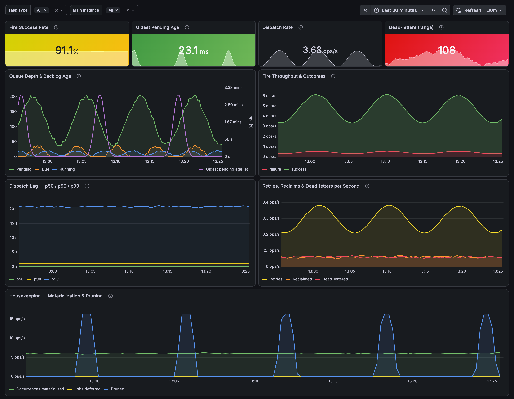
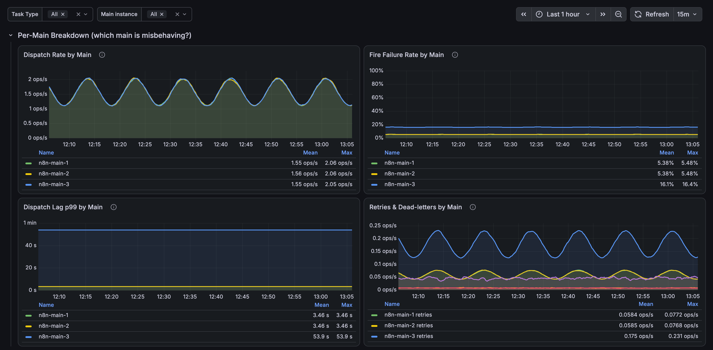

# n8n Durable Scheduler Dashboard

Queue depth, scheduling lag, dispatch throughput, retries, and dead-letters for
n8n's Durable Scheduler.

## Screenshots



Expand the collapsed **Per-Main Breakdown** row to compare mains side by side (here
`n8n-main-3` is degraded — higher failure rate, worse lag p99, more dead-letters):



## Prerequisites

Enable metrics in n8n:

```
N8N_METRICS=true
N8N_METRICS_INCLUDE_SCHEDULER_METRICS=true
```

Scheduler metrics are emitted by **main** instances only. Optional:
`N8N_METRICS_SCHEDULER_INTERVAL` (seconds, default 20) sets the snapshot-gauge
cache TTL.

See the [n8n Prometheus docs](https://docs.n8n.io/hosting/configuration/configuration-examples/prometheus/).
Verify at `http://your-n8n-host.com/metrics` — look for `n8n_scheduler_*` series.

## Import into Grafana

1. **Dashboards → Import**
2. **Upload dashboard JSON file** → [`n8n-scheduler.json`](n8n-scheduler.json)
3. Select your Prometheus datasource
4. **Import**

## Panels

Four stat tiles across the top, then five time-series rows, then a collapsed
per-main row.

| Panel | Shows | Action if it looks wrong |
|-------|-------|--------------------------|
| Fire Success Rate | Share of finished tasks that succeeded | Below ~90%: break down by task type — one type is a node bug, all types point to infra/DB |
| Oldest Pending Age | Age of the oldest due task; growth means backlog | Climbing: dispatch can't keep up — check DB load and main count, then the Per-Main row |
| Dispatch Rate | Tasks handed to a handler per second | Drops to zero unexpectedly: no main is dispatching — check main health and the Per-Main row |
| Dead-letters (range) | Tasks permanently failed over the range | Above zero: inspect that task type's logs; use the Per-Main row to find the source node |
| Queue Depth & Backlog Age | Pending / due / running, plus oldest-age on a second axis | Backlog age rising while running is flat: dispatch is stalled — see Oldest Pending Age |
| Fire Throughput & Outcomes | Success vs failure per second (stack height = throughput) | Failure share rising: filter by task type to isolate the failing handler |
| Dispatch Lag p50/p90/p99 | Delay from due to dispatched | p99 diverging while p50 stays low: a subset is stuck (lease contention, DB locks) — compare by type and main |
| Retries, Reclaims & Dead-letters | Recoverable vs permanent failures | Reclaims rising: mains are losing leases (crash, GC, network). Dead-letters: inspect logs |
| Housekeeping — Materialization & Pruning | Occurrences materialized, jobs deferred, tasks pruned | Materialization flat at zero or pruning never runs: check the leader main (the one main that runs background jobs) |
| Per-Main Breakdown | Dispatch rate, failure rate, lag p99, dead-letters `by (instance)` — collapsed by default | One main diverging: node-local problem — drain or restart that instance |

The same "action if it looks wrong" note is on each panel's tooltip (the ⓘ icon),
as a **"When bad"** line.

## Variables

- **Task Type** — filters throughput, lag, retry and success-rate panels. The
  snapshot gauges have no task-type label and always show cluster totals.
- **Main instance** — filters every panel by the Prometheus `instance` label.

## Per-main diagnostics

The **Per-Main Breakdown** row is collapsed by default; expand it to split its
panels `by (instance)` and find a single misbehaving main: a flatlined dispatch
rate, a rising failure ratio or dead-letter count, or a diverging lag p99.

This is meaningful only for counters and the lag histogram, which each main
records for its own work. The snapshot gauges are cluster-wide and identical on
every main, so they are not split by instance.

`instance` only distinguishes mains if Prometheus scrapes each main as its own
target. Mains behind a single load-balanced address collapse into one `instance`.

## Metrics

The four gauges are the **snapshot gauges** referred to throughout this README —
cluster-wide values read on each scrape.

| Metric | Type | Labels |
|--------|------|--------|
| `n8n_scheduler_tasks_pending` | gauge (snapshot) | — |
| `n8n_scheduler_tasks_due` | gauge (snapshot) | — |
| `n8n_scheduler_tasks_running` | gauge (snapshot) | — |
| `n8n_scheduler_oldest_pending_age_seconds` | gauge (snapshot) | — |
| `n8n_scheduler_tasks_dispatched_total` | counter | `task_type` |
| `n8n_scheduler_tasks_completed_total` | counter | `task_type`, `result` |
| `n8n_scheduler_task_retries_total` | counter | `task_type` |
| `n8n_scheduler_dispatch_lag_seconds` | histogram | `task_type` |
| `n8n_scheduler_occurrences_materialized_total` | counter | — |
| `n8n_scheduler_jobs_deferred_total` | counter | — |
| `n8n_scheduler_tasks_reclaimed_total` | counter | — |
| `n8n_scheduler_tasks_dead_lettered_total` | counter | — |
| `n8n_scheduler_tasks_pruned_total` | counter | — |

Queries assume the default `n8n_` prefix; adjust them if you set
`N8N_METRICS_PREFIX`.

## Aggregation notes

- **Gauges are cluster-wide** — identical on every main. Aggregate with `max` or
  `avg`, never `sum` (which multiplies by the main count). This dashboard uses `max`.
- **Counters are per-main** — summed across mains for cluster throughput.
- `oldest_pending_age_seconds` is 0 when there is no due backlog.
