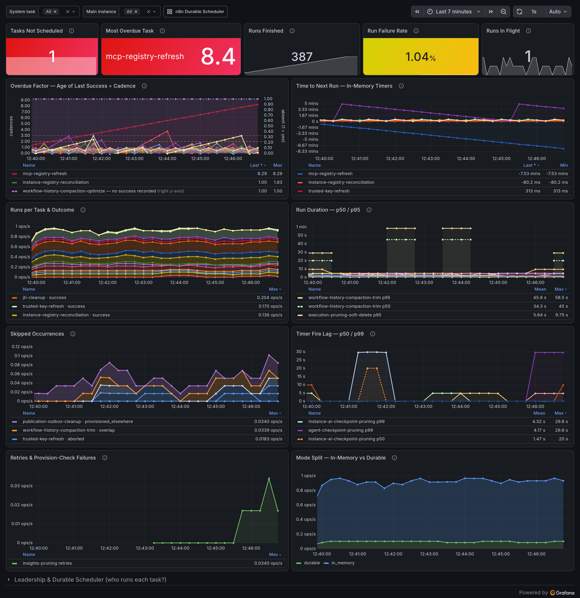

# n8n System Tasks Dashboard

Every system task on one screen: which ones ran, which ones are late, and which
ones stopped for good.

System tasks are n8n's own background jobs: pruning, compaction, license renewal,
registry reconciliation. Today they run on timers inside the leader main
instance. When one stops quietly, you usually find out from the damage: a full
disk, an expired license.

## Screenshot



## Prerequisites

Turn on metrics in n8n:

```
N8N_METRICS=true
N8N_METRICS_INCLUDE_SYSTEM_TASK_METRICS=true
```

The two `n8n_scheduler_*` panels in the collapsed **Leadership & Durable
Scheduler** row also need:

```
N8N_METRICS_INCLUDE_SCHEDULER_METRICS=true
```

Only **main** instances emit these metrics, and only from n8n 2.41.0.

See the [n8n Prometheus docs](https://docs.n8n.io/hosting/configuration/configuration-examples/prometheus/).
To check, open `http://your-n8n-host.com/metrics` and look for
`n8n_system_task_*`.

## Import into Grafana

1. **Dashboards → Import**
2. **Upload dashboard JSON file** → [`n8n-system-tasks.json`](n8n-system-tasks.json)
3. Select your Prometheus datasource
4. **Import**

This dashboard links to the [n8n Durable Scheduler](../n8n-scheduler/) dashboard
from its header, and that one links back here.

## How "late" is measured

`n8n_system_task_interval_seconds` gives each task its own cadence. The **Overdue
Factor** panel divides the age of the last success by that cadence, so the number
you read is "how many cadences behind". One set of thresholds then works for every
task, whether it runs every 30 seconds or once a day, and there is no per-task
list to keep up to date.

Tasks on a cron schedule report no cadence, so they never appear on that panel.
No system task uses a cron schedule today.

Overdue Factor looks backwards, at the last success. **Time to Next Run**, next to
it, looks forward: `n8n_system_task_next_run_timestamp_seconds` is the moment the
next occurrence is due, and an in-memory timer re-arms it at every fire. It stops
advancing as soon as a task can no longer plan its schedule, so a countdown
crossing zero catches a stalled timer without waiting for a cadence to elapse.
In-memory timers only, cron ones included.

## Panels

Five stat tiles across the top, then five rows of time series, then a collapsed
row.

| Panel | Shows | Action if it looks wrong |
|-------|-------|--------------------------|
| Tasks Not Scheduled | Tasks n8n failed to schedule, either in memory or on the durable scheduler | Above zero, that task will not run again until the main restarts or leadership moves. Find it on Overdue Factor, then read the main's logs |
| Most Overdue Task | The task furthest behind, counted in its own cadences | Above 2 it missed a run. Above 3 and still rising, it has stopped. Check Tasks Not Scheduled, then Runs per Task and Skipped Occurrences |
| Runs Finished | Runs that finished in the selected range, success or failure. Same set of runs as the Run Failure Rate denominator | If it barely grows as you widen the range, the tasks are not running. Check Tasks Not Scheduled, then Overdue Factor |
| Run Failure Rate | Share of finished runs that failed. `aborted` runs count on neither side | Above about 1%, break it down on Runs per Task. One task points at that task's own dependency; every task points at the database or the host |
| Runs In Flight | Runs happening right now, across all tasks and both modes | If it stays above zero for longer than Run Duration p95, a run is hung. Its next occurrences show up as `overlap` |
| Overdue Factor | Age of the last success divided by that task's cadence | A line above 2 missed an occurrence. A purple line means no success recorded at all: normal for a few minutes after a failover, a problem if it lasts |
| Time to Next Run | Seconds until the occurrence each in-memory timer is armed for | A sawtooth peaking at that task's cadence is healthy. A line falling through zero is a timer that stopped planning: check Tasks Not Scheduled, then the leader's logs |
| Runs per Task & Outcome | Finished runs per second, by task and result | Red on one task points at that task's dependency; red on all of them at the database or the host. A stack that disappears means the task stopped |
| Run Duration p50 / p95 | How long runs take | p95 close to the task's cadence means the next run will overlap. p95 stuck in the top bucket means runs are hung |
| Skipped Occurrences | Occurrences that came due but did not run, by reason | Steady `overlap` means runs take longer than their cadence; compare with p95. Steady `coalesced` means the host suspends, or the event loop is blocked |
| Timer Fire Lag p50 / p99 | How late each timer fires | p50 above a second means the event loop is blocked. p99 in hours means the host was suspended or is overloaded |
| Retries & Provision-Check Failures | Retries after a failed run, and failed lookups for a task's durable job | Retries rising together with red on Runs per Task means a task keeps failing. Any provision-check failure points at the scheduler tables or the database connection |
| Mode Split | Runs per second on the in-memory timer against the durable scheduler | If both modes carry the same task at once, two paths are running it. `provisioned_elsewhere` on Skipped Occurrences is how the in-memory path is meant to stand down |
| Leaders per Task (collapsed) | How many mains export in-memory series for each task | 2 means two mains believe they lead, so the task runs twice: check leader election and clock skew. 0 means nobody runs it |
| Durable Scheduler — System Task Outcomes (collapsed) | Scheduler outcomes for `task_type=~"system:.*"` | Failures here while Runs per Task stays green mean the task fails before its handler runs. Open the Durable Scheduler dashboard |
| Durable Scheduler — System Task Dispatch Lag (collapsed) | The durable version of Timer Fire Lag | p99 rising while p50 stays low means occurrences are stuck on lease contention or database locks. Open the Durable Scheduler dashboard |

Every panel repeats its action note in its tooltip (the ⓘ icon) as a **"When
bad"** line.

## The durable panels are empty today

No system task sets `durable = true`, and durable mode needs both
`N8N_SCHEDULER_ENABLED` and `N8N_SCHEDULER_SYSTEM_TASKS_ENABLED`, which are false
by default. So every run is `in_memory`: `durable` stays at zero on **Mode
Split**, and the two **Durable Scheduler** panels show nothing. That reading is
correct, not a broken datasource. The panels are here so the dashboard still works
the day a task becomes durable.

## Variables

- **System task** filters every panel by the `task` label. The two Durable
  Scheduler panels read the durable scheduler's own `task_type` label, so this
  variable does not change them.
- **Main instance** filters every panel by the Prometheus `instance` label. It
  only tells mains apart if Prometheus scrapes each main as its own target. Mains
  behind one load-balanced address look like a single instance.

## Metrics

| Metric | Type | Labels |
|--------|------|--------|
| `n8n_system_task_info` | gauge | `task`, `mode` |
| `n8n_system_task_scheduled` | gauge | `task`, `mode` |
| `n8n_system_task_interval_seconds` | gauge | `task` |
| `n8n_system_task_next_run_timestamp_seconds` | gauge | `task` |
| `n8n_system_task_runs_in_flight` | gauge | `task`, `mode` |
| `n8n_system_task_last_success_timestamp_seconds` | gauge | `task`, `mode` |
| `n8n_system_task_run_duration_seconds` | histogram | `task`, `mode`, `result` |
| `n8n_system_task_runs_skipped_total` | counter | `task`, `reason` |
| `n8n_system_task_retries_total` | counter | `task` |
| `n8n_system_task_provision_check_failures_total` | counter | `task` |
| `n8n_system_task_fire_lag_seconds` | histogram | `task` |

| Label | Values |
|-------|--------|
| `task` | The system task's name |
| `mode` | `in_memory`, `durable`. Only on the metrics whose row lists it |
| `result` | `success`, `failure`, `aborted` |
| `reason` | `overlap`, `provisioned_elsewhere`, `aborted`, `coalesced` |

Queries use the default `n8n_` prefix. Adjust them if you set
`N8N_METRICS_PREFIX`.

## Easy things to get wrong

- **`aborted` is not a failure.** `result="aborted"` is a run stopping cleanly at
  shutdown or leader stepdown. `reason="aborted"` and `reason="coalesced"` are
  just as harmless. All three have their own colour here, never red.
- **A missing last-success series does not mean the task is fine.** A leader drops
  its in-memory gauges when it steps down, so after a failover a task reads as
  *absent* until its first success on the new leader. Overdue Factor draws those
  on its right axis in purple instead of leaving a silent gap.
- **Use `max by (task)` for a task's gauges, `sum` for counters and histograms.**
  Summing a per-task gauge across mains multiplies it by the number of mains.
  `n8n_system_task_runs_in_flight` is the exception and is summed: it counts the
  runs in flight *on that instance*, so runs on two mains are two different runs.
  `max` there would undercount a durable task dispatched to several mains, and
  would hide a split brain running an in-memory task twice.
- **`n8n_system_task_runs_skipped_total` has no `mode` label.** It only exists for
  in-memory runs, so filtering it by `mode` returns nothing. Retries, fire lag and the next-run
  gauge are in-memory only too. On the durable side, read
  `n8n_scheduler_task_retries_total` and `n8n_scheduler_dispatch_lag_seconds`.
- **`n8n_system_task_scheduled == 0` means the task is dead.** It is an exact
  signal rather than a timeout guess, which is why it sits on the stat row.

## Mock data

Real cadences run in minutes and hours, and produce no failures, no skips and no
durable runs. For demos and screenshots,
[`mocks/n8n-system-tasks/`](../../../mocks/n8n-system-tasks/) ships a synthetic
exporter instead.
