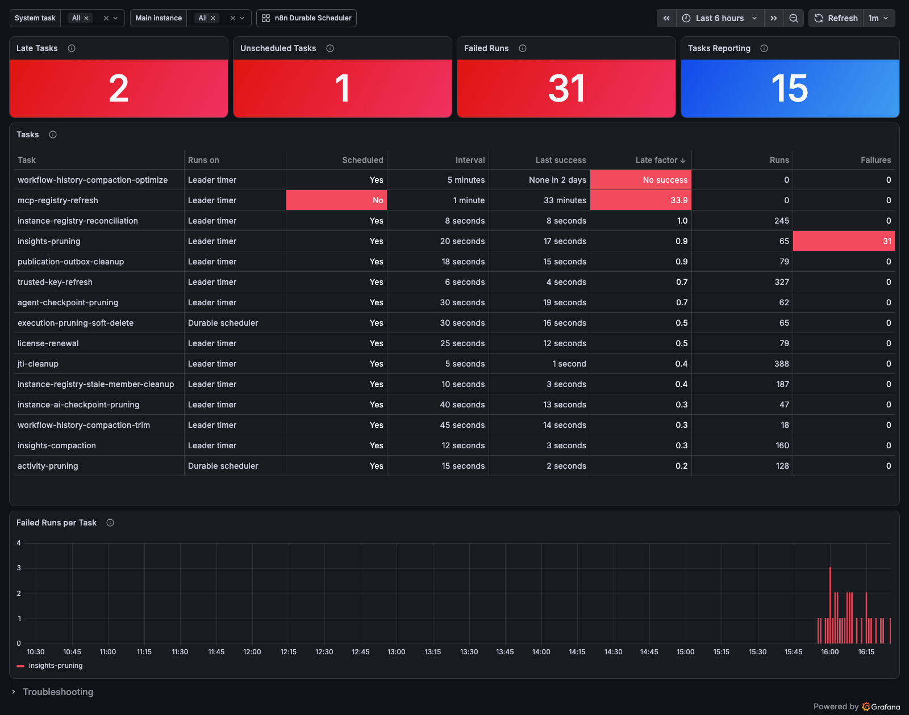

# n8n System Tasks Dashboard

Is every n8n system task running? Late or failing tasks show in red.

System tasks are n8n's own background jobs: pruning, compaction, license renewal,
registry reconciliation. They run on the durable scheduler, or on a timer on the
leader main. When one stops quietly, you usually find out from the damage: a full
disk, an expired license.

## Screenshot



## Prerequisites

Turn on metrics in n8n:

```
N8N_METRICS=true
N8N_METRICS_INCLUDE_SYSTEM_TASK_METRICS=true
```

Only **main** instances emit these metrics, and only from n8n 2.41.0.

See the [n8n Prometheus docs](https://docs.n8n.io/hosting/configuration/configuration-examples/prometheus/).
To check, open `http://your-n8n-host.com/metrics` and look for
`n8n_system_task_*`.

## Import into Grafana

1. **Dashboards → Import**
2. **Upload dashboard JSON file** → [`n8n-system-tasks.json`](n8n-system-tasks.json)
3. Select your Prometheus datasource
4. **Import**

This dashboard links to the [n8n Durable Scheduler](../n8n-scheduler/) dashboard
from its header, and that one links back here.

## How to read it

1. Look at the four tiles. **Late Tasks**, **Unscheduled Tasks** and **Failed Runs** are green at 0. Anything else is red.
2. If a tile is red, find the task in the **Tasks** table. The table puts the latest task first.
3. Expand **Troubleshooting** only to find why a task is late or failing.

## Panels

| Panel | Shows | Bad when |
|-------|-------|----------|
| Late Tasks | Tasks whose last success is older than two of their intervals, or that have no success in 2 days | Above zero |
| Unscheduled Tasks | Tasks that n8n could not schedule, and durable tasks whose stored job is disabled, quarantined or missing | Above zero. A timer task stays stopped until a main restarts: read the logs of the mains. For a durable task, check its row in `scheduled_job` |
| Failed Runs | Failed runs in the selected time range | Above zero |
| Tasks Reporting | System tasks that the mains report now | Lower than usual. A missing task is not monitored |
| Tasks | One row for each task: where it runs, whether it is scheduled, its interval, its last success, its late factor, and its runs and failures in the time range | A red cell |
| Failed Runs per Task | Failed runs over time, by task. Empty while every task succeeds | One task fails again and again |
| Troubleshooting (collapsed) | Run duration p95, runs in progress, skipped runs, retries, and time to next run | See the tooltip of each panel |

Each panel repeats its **Bad when** note in its tooltip (the ⓘ icon).

## How "late" is measured

`n8n_system_task_interval_seconds` gives the interval of each task. The **late
factor** is the age of the last success divided by that interval. 1 is normal.
2 or more means the task missed a run. One threshold then works for a task that
runs every 30 seconds and for a task that runs once a day.

The last success is the most recent one on any main **in the last 2 days**
(`max_over_time(...[2d])`). The gauge lives in the memory of each process, so a
restart removes it until the next success. The 2-day window keeps the last value
of the replaced pod, so a restart does not make a daily task look broken. A task
with no success in 2 days counts as late.

Tasks on a cron schedule report no interval, so they have no late factor. They
count as late only when they have no success in 2 days.

## Variables

- **System task** filters every panel by the `task` label.
- **Main instance** filters every panel by the Prometheus `instance` label. It
  only tells mains apart if Prometheus scrapes each main as its own target.

## Metrics

| Metric | Type | Labels |
|--------|------|--------|
| `n8n_system_task_info` | gauge | `task`, `mode` |
| `n8n_system_task_scheduled` | gauge | `task`, `mode` |
| `n8n_system_task_interval_seconds` | gauge | `task` |
| `n8n_system_task_last_success_timestamp_seconds` | gauge | `task`, `mode` |
| `n8n_system_task_run_duration_seconds` | histogram | `task`, `mode`, `result` |
| `n8n_system_task_runs_in_flight` | gauge | `task`, `mode` |
| `n8n_system_task_next_run_timestamp_seconds` | gauge | `task` |
| `n8n_system_task_runs_skipped_total` | counter | `task`, `reason` |
| `n8n_system_task_retries_total` | counter | `task` |

| Label | Values |
|-------|--------|
| `task` | The system task's name |
| `mode` | `durable`, `leader_timer`, `instance_timer`. n8n 2.41 uses `in_memory` instead of the two timer values |
| `result` | `success`, `failure`, `aborted` |
| `reason` | `overlap`, `provisioned_elsewhere`, `aborted`, `coalesced` |

Queries use the default `n8n_` prefix. Adjust them if you set
`N8N_METRICS_PREFIX`.

## Easy things to get wrong

- **Durable tasks have no timer.** Skipped runs and retries exist only for timer
  tasks. `n8n_system_task_next_run_timestamp_seconds` covers durable tasks only on
  n8n versions that read the stored next run of their job. On older versions, use
  the **Tasks** table to check a durable task. A durable task whose job is
  disabled has no next run: it leaves **Time to Next Run** and counts in
  **Unscheduled Tasks**.
- **A daily task often shows 0 runs.** A daily task has few runs in the time
  range. Read **Last success** first. On n8n versions that do not start the run
  series at zero, `increase()` also misses the first run, or the first failure,
  after a restart.
- **`aborted` is not a failure.** A run that stops at shutdown or at a leader
  change reports `result="aborted"`. The dashboard never counts it as a failure.
- **For the scheduler side of durable tasks**, open the n8n Durable Scheduler
  dashboard from the header link.

## Mock data

Real cadences run in minutes and hours, and produce no failures, no skips and no
durable runs. For demos and screenshots,
[`mocks/n8n-system-tasks/`](../../../mocks/n8n-system-tasks/) ships a synthetic
exporter instead.
